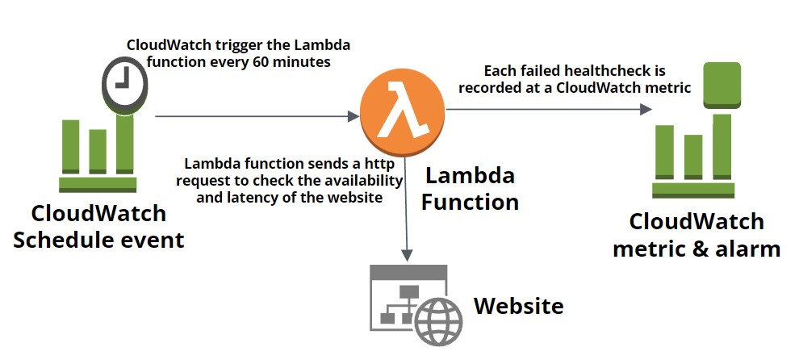

# AWS Lambda Simple Webapp Healthcheck CDK Pyhton Project

This project demonstrates a CDK app with an instance of a stack (`web_health_check_stack`). This project creates a Lambda Function that checks the `availability` and `latency` of the websites. The lambda function after obtaining the metrics publishes them on CloudWatch. Also, Convert the lambda function into a cron job on 60 min intervals. The `boto3` will be used to create the metrics on CloudWatch. And then alarms are created on those metrics.

## Architecture Diagram:

<div align="center">
   <div align="center">
    
  </div>
</div>
</br>


The `cdk.json` file tells the CDK Toolkit how to execute your app.

This project is set up like a standard Python project.  The initialization process also creates
a virtualenv within this project, stored under the .venv directory.  To create the virtualenv
it assumes that there is a `python3` executable in your path with access to the `venv` package.
If for any reason the automatic creation of the virtualenv fails, you can create the virtualenv
manually once the init process completes.

To manually create a virtualenv on MacOS and Linux:

```
$ python -m venv .venv
```

After the init process completes and the virtualenv is created, you can use the following
step to activate your virtualenv.

```
$ source .venv/bin/activate
```

If you are a Windows platform, you would activate the virtualenv like this:

```
% .venv\Scripts\activate.bat
```

Once the virtualenv is activated, you can install the required dependencies.

```
$ pip install -r requirements.txt
```

At this point you can now synthesize the CloudFormation template for this code.

```
$ cdk synth
```

You can now begin exploring the source code, contained in the hello directory.
There is also a very trivial test included that can be run like this:

```
$ pytest
```

To add additional dependencies, for example other CDK libraries, just add to
your requirements.txt file and rerun the `pip install -r requirements.txt`
command.

## Useful commands

 * `cdk ls`          list all stacks in the app
 * `cdk synth`       emits the synthesized CloudFormation template
 * `cdk deploy`      deploy this stack to your default AWS account/region
 * `cdk diff`        compare deployed stack with current state
 * `cdk docs`        open CDK 
 
 ## Useful links

 - AWS Lambda: https://docs.aws.amazon.com/cdk/api/v1/python/aws_cdk.aws_lambda/README.html
 - AWS Lamda IAM Role: https://docs.aws.amazon.com/cdk/api/v1/python/aws_cdk.aws_iam/Role.html
 - AWS Events: https://docs.aws.amazon.com/cdk/api/v1/python/aws_cdk.aws_events/README.html
 - AWS Events Targets: https://docs.aws.amazon.com/cdk/api/v1/python/aws_cdk.aws_events_targets/README.html
 - AWS CloudWatch: https://docs.aws.amazon.com/cdk/api/v1/python/aws_cdk.aws_cloudwatch/README.html
 - AWS CloudWatch Alarm: https://docs.aws.amazon.com/cdk/api/v1/python/aws_cdk.aws_cloudwatch/Alarm.html
 - Boto3: https://boto3.amazonaws.com/v1/documentation/api/latest/index.html
 - Boto3 CloudWatch: https://boto3.amazonaws.com/v1/documentation/api/latest/reference/services/cloudwatch.html
 