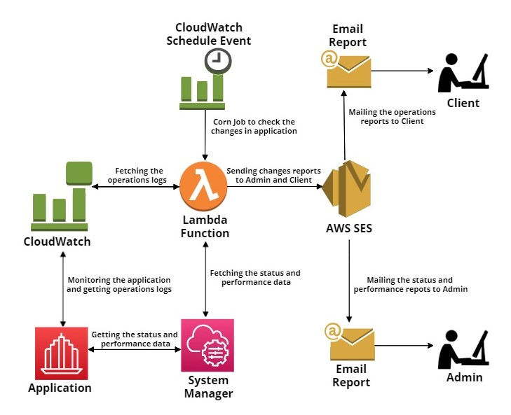

# AWS CDK Pyhton Application Notifications System Project

## Project Description
This project uses the AWS CDK in Python to create a notification system for an application. The notification system includes `AWS Systems Manager` to monitor the status and performance of the applications by collecting and analyzing operational data and `AWS CloudWatch` to monitor the operations of the application. A `Corn Job` will be run after every specific time period and collect the status and logs of the application. The lambda function is created to send that reports to the Admins about performance and operations of the application and client about operations within the system, and notifies clients about any changes. The Client and Admin will receive the notification through`AWS SES` email service.

## Architecture Diagram:

<div align="center">
   <div align="center">
    
  </div>
</div>
</br>


The `cdk.json` file tells the CDK Toolkit how to execute your app.

This project is set up like a standard Python project.  The initialization
process also creates a virtualenv within this project, stored under the `.venv`
directory.  To create the virtualenv it assumes that there is a `python3`
(or `python` for Windows) executable in your path with access to the `venv`
package. If for any reason the automatic creation of the virtualenv fails,
you can create the virtualenv manually.

To manually create a virtualenv on MacOS and Linux:

```
$ python -m venv .venv
```

After the init process completes and the virtualenv is created, you can use the following
step to activate your virtualenv.

```
$ source .venv/bin/activate
```

If you are a Windows platform, you would activate the virtualenv like this:

```
% .venv\Scripts\activate.bat
```

Once the virtualenv is activated, you can install the required dependencies.

```
$ pip install -r requirements.txt
```

At this point you can now synthesize the CloudFormation template for this code.

```
$ cdk synth
```

To add additional dependencies, for example other CDK libraries, just add
them to your `setup.py` file and rerun the `pip install -r requirements.txt`
command.

## Useful commands

 * `cdk ls`          list all stacks in the app
 * `cdk synth`       emits the synthesized CloudFormation template
 * `cdk deploy`      deploy this stack to your default AWS account/region
 * `cdk diff`        compare deployed stack with current state
 * `cdk docs`        open CDK documentation


## Connect with Me 🤝🏻 &nbsp;

<h3 align="center">
<a href="https://linkedin.com/in/ahmedtariq01"></a>
<a href="https://twitter.com/imahmedt" target="_blank"></a>


## Support Me 💰

<h3 align="justify">If you like my work, you can buy me a coffee ☕. It will help me to keep creating more content.</h3>
<h3 align="center">
<a href="https://www.buymeacoffee.com/ahmedtariq" target="_blank"></a>
</h3>