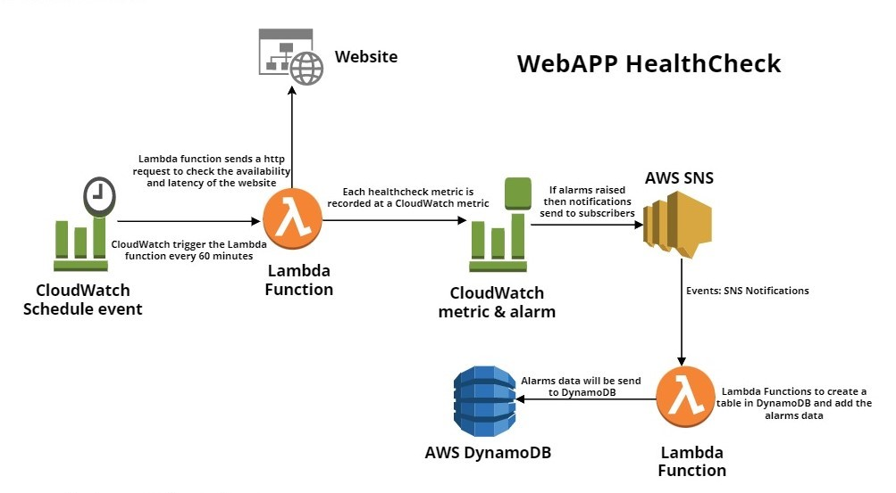
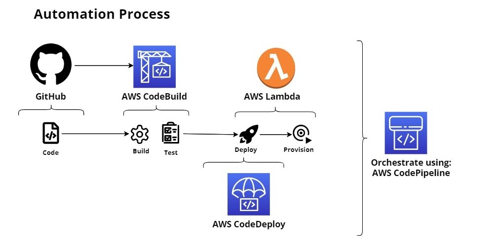

# Automation of AWS Lambda Webapp Healthcheck CDK Pyhton Project

## Project Description
This project demonstrates a CDK app with an instance of a stack (`web_health_check_stack`). This project creates a Lambda Function that checks the `availability` and `latency` of the websites. The lambda function after obtaining the metrics publishes them on CloudWatch. Also, convert the lambda function into a cron job on 60 min intervals. The `boto3` will be used to create the metrics on CloudWatch. Then alarms are created on those metrics. If latency or availability exceeds the thresholds then alarms will be raised. For that, alarms will be linked with `AWS SNS`. If alarms are raised then an email will be sent to the developer. One more lambda function will be created that will create a table in `DynamoDb` and write the alarms in the table. This data will be used for analytics work.
For the `Automation of WebApp HealthCheck` a multi-stage pipeline having Beta and Prod stage using CDK is created. The project code is deployed in 1 Region. `Beta` stage must have bakeTimes, code-review, and test blockers. `Unit tests` are written for the web crawler. The CloudWatch metrics and alarms are emitted for the operational health of the web crawler, including `duration` and `invocations` to process each crawler run. `Automate rollback` to the last build if metrics are in alarm. 

## Architecture Diagram:

### WebApp HealthCheck Architecture Diagram
<div align="center">
   <div align="center">
    
  </div>
</div>
</br>

### Automation of WebApp HealthCheck Architecture Diagram
<div align="center">
   <div align="center">
    
  </div>
</div>
</br>

The `cdk.json` file tells the CDK Toolkit how to execute your app.

This project is set up like a standard Python project.  The initialization process also creates
a virtualenv within this project, stored under the .venv directory.  To create the virtualenv
it assumes that there is a `python3` executable in your path with access to the `venv` package.
If for any reason the automatic creation of the virtualenv fails, you can create the virtualenv
manually once the init process completes.

To manually create a virtualenv on MacOS and Linux:

```
$ python -m venv .venv
```

After the init process completes and the virtualenv is created, you can use the following
step to activate your virtualenv.

```
$ source .venv/bin/activate
```

If you are a Windows platform, you would activate the virtualenv like this:

```
% .venv\Scripts\activate.bat
```

Once the virtualenv is activated, you can install the required dependencies.

```
$ pip install -r requirements.txt
```

At this point you can now synthesize the CloudFormation template for this code.

```
$ cdk synth
```

You can now begin exploring the source code, contained in the hello directory.
There is also a very trivial test included that can be run like this:

```
$ pytest
```

To add additional dependencies, for example other CDK libraries, just add to
your requirements.txt file and rerun the `pip install -r requirements.txt`
command.

## Useful commands

 * `cdk ls`          list all stacks in the app
 * `cdk synth`       emits the synthesized CloudFormation template
 * `cdk deploy`      deploy this stack to your default AWS account/region
 * `cdk diff`        compare deployed stack with current state
 * `cdk docs`        open CDK 
 
 ## Useful links

 - AWS Lambda: https://docs.aws.amazon.com/cdk/api/v1/python/aws_cdk.aws_lambda/README.html
 - AWS Lamda IAM Role: https://docs.aws.amazon.com/cdk/api/v1/python/aws_cdk.aws_iam/Role.html
 - AWS Events: https://docs.aws.amazon.com/cdk/api/v1/python/aws_cdk.aws_events/README.html
 - AWS Events Targets: https://docs.aws.amazon.com/cdk/api/v1/python/aws_cdk.aws_events_targets/README.html
 - AWS CloudWatch: https://docs.aws.amazon.com/cdk/api/v1/python/aws_cdk.aws_cloudwatch/README.html
 - AWS CloudWatch Alarm: https://docs.aws.amazon.com/cdk/api/v1/python/aws_cdk.aws_cloudwatch/Alarm.html
 - Boto3: https://boto3.amazonaws.com/v1/documentation/api/latest/index.html
 - Boto3 CloudWatch: https://boto3.amazonaws.com/v1/documentation/api/latest/reference/services/cloudwatch.html
 - AWS SNS: https://docs.aws.amazon.com/cdk/api/v1/python/aws_cdk.aws_sns/README.html
 - AWS SNS Subscriptions: https://docs.aws.amazon.com/cdk/api/v1/python/aws_cdk.aws_sns_subscriptions.html
 - AWS SNS Topic: https://docs.aws.amazon.com/cdk/api/v1/python/aws_cdk.aws_sns/Topic.html
 - AWS SNS Email subscription : https://docs.aws.amazon.com/cdk/api/v1/python/aws_cdk.aws_sns_subscriptions/EmailSubscription.html
 - AWS CloudWatch Actions: https://docs.aws.amazon.com/cdk/api/v1/python/aws_cdk.aws_cloudwatch_actions.html
 - AWS CloudWatch SNSAction: https://docs.aws.amazon.com/cdk/api/v1/python/aws_cdk.aws_cloudwatch_actions/SnsAction.html
 - AWS DynamoDB: https://docs.aws.amazon.com/cdk/api/v1/python/aws_cdk.aws_dynamodb.html
 - AWS DynmoDB create table: https://docs.aws.amazon.com/cdk/api/v1/python/aws_cdk.aws_dynamodb/Table.html
 - Boto3 DynamoDB: https://boto3.amazonaws.com/v1/documentation/api/latest/reference/services/dynamodb.html
 - Boto3 DynamoDB create table: https://boto3.amazonaws.com/v1/documentation/api/latest/reference/services/dynamodb.html#DynamoDB.Client.create_table
 

## Connect with Me 🤝🏻 &nbsp;

<h3 align="center">
<a href="https://linkedin.com/in/ahmedtariq01"></a>
<a href="https://twitter.com/imahmedt" target="_blank"></a>


## Support Me 💰

<h3 align="justify">If you like my work, you can buy me a coffee ☕. It will help me to keep creating more content.</h3>
<h3 align="center">
<a href="https://www.buymeacoffee.com/ahmedtariq" target="_blank"></a>
</h3>