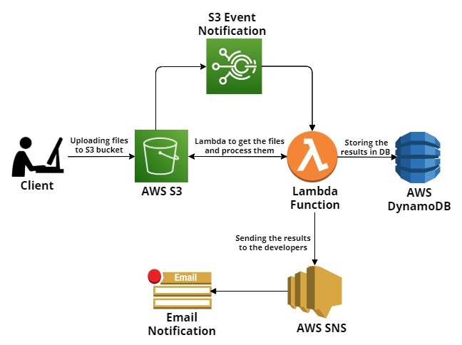

# Welcome to your CDK Python project!
## Project Description:
This project uses the `AWS CDK` in Python to create an S3 bucket, Lambda functions and SNS notification system. When user upload the files on S3 bucket, S3 event trigger notify Lambda when a new file is uploaded to the bucket. Lambda function parse the text in each file and count the number of times each word is repeated. Then the function stores the word-count results in a database and send an email to the specified email address with the results of the word-counting process. Test your code by uploading sample files to the S3 bucket and verifying that the word-count results are stored and emailed as expected.

## Architecture Diagram:

<div align="center">
   <div align="center">
    
  </div>
</div>
</br>

The `cdk.json` file tells the CDK Toolkit how to execute your app.

This project is set up like a standard Python project.  The initialization
process also creates a virtualenv within this project, stored under the `.venv`
directory.  To create the virtualenv it assumes that there is a `python3`
(or `python` for Windows) executable in your path with access to the `venv`
package. If for any reason the automatic creation of the virtualenv fails,
you can create the virtualenv manually.

To manually create a virtualenv on MacOS and Linux:

```
$ python -m venv .venv
```

After the init process completes and the virtualenv is created, you can use the following
step to activate your virtualenv.

```
$ source .venv/bin/activate
```

If you are a Windows platform, you would activate the virtualenv like this:

```
% .venv\Scripts\activate.bat
```

Once the virtualenv is activated, you can install the required dependencies.

```
$ pip install -r requirements.txt
```

At this point you can now synthesize the CloudFormation template for this code.

```
$ cdk synth
```

To add additional dependencies, for example other CDK libraries, just add
them to your `setup.py` file and rerun the `pip install -r requirements.txt`
command.

## Useful commands

 * `cdk ls`          list all stacks in the app
 * `cdk synth`       emits the synthesized CloudFormation template
 * `cdk deploy`      deploy this stack to your default AWS account/region
 * `cdk diff`        compare deployed stack with current state
 * `cdk docs`        open CDK documentation

Enjoy!


